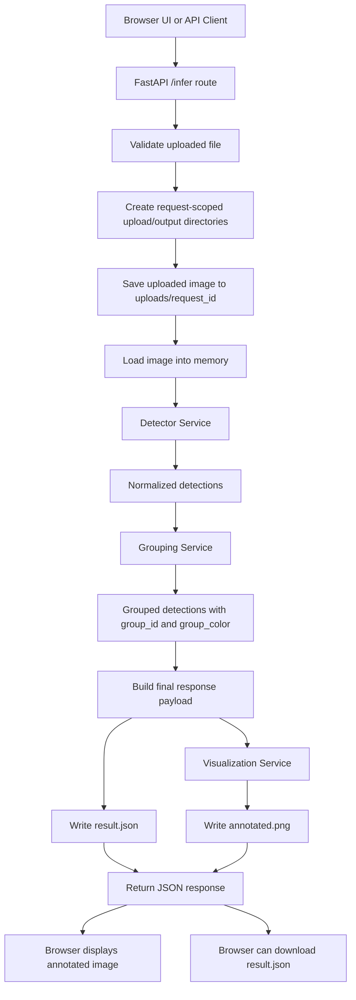

# ShelfScope

## Overview

ShelfScope is a locally runnable retail shelf AI pipeline built around a FastAPI application.

The system accepts a shelf image from a browser UI or API request, detects products on the shelf, groups visually similar products, generates a color-coded visualization, stores the output artifacts on disk, and returns a structured JSON response.

The current implementation is organized in three layers:

- `app.py`: application setup and FastAPI bootstrap
- `api.py`: API routes and request orchestration
- `src/`: configuration, utilities, and service logic

## FastAPI Architecture

The application now uses FastAPI instead of Flask.

Key changes:

- the HTTP layer is implemented with FastAPI
- route definitions live in [api.py](c:\Users\kevin\Desktop\VSCode\Infilect\api.py)
- application construction and service wiring live in [app.py](c:\Users\kevin\Desktop\VSCode\Infilect\app.py)
- the `/infer` endpoint is asynchronous
- blocking work such as image loading, model inference, grouping, visualization writing, and JSON writing is offloaded with `run_in_threadpool`
- output rendering and JSON file writing are executed concurrently with `asyncio.gather(...)`

This keeps the API layer cleaner and makes the app easier to deploy under an ASGI server.

## Project Structure

```text
ShelfScope/
|-- api.py
|-- app.py
|-- pyproject.toml
|-- README.md
|-- src/
|   |-- __init__.py
|   |-- config.py
|   |-- utils.py
|   `-- services/
|       |-- __init__.py
|       |-- detector.py
|       |-- grouping.py
|       `-- visualization.py
|-- templates/
|   `-- index.html
|-- tests/
|   |-- conftest.py
|   |-- test_app.py
|   |-- test_fixtures_smoke.py
|   `-- test_grouping.py
```

## End-to-End Flow



## Service Responsibilities

### `app.py`

Responsibilities:

- create the FastAPI application
- configure upload/output directories
- register shared services on `app.state`
- include the API router
- launch `uvicorn` when run directly

### `api.py`

Responsibilities:

- define the FastAPI routes
- validate inputs
- load and save request files
- orchestrate detector, grouping, and visualization services
- return JSON or file responses

Routes:

- `GET /`: render the browser UI
- `POST /infer`: upload image and run the full pipeline
- `GET /outputs/{request_id}/{filename}`: serve generated artifacts

### `src/services/detector.py`

Responsibilities:

- lazy-load the product detector
- run product detection on the shelf image
- normalize detections into a common schema

Model:

- `is36e/detr-resnet-50-sku110k`

### `src/services/grouping.py`

Responsibilities:

- crop detected products
- compute lightweight handcrafted visual embeddings
- compare embeddings using cosine similarity
- assign a request-local `group_id` and `group_color`

### `src/services/visualization.py`

Responsibilities:

- draw bounding boxes and labels
- color-code detections by group
- save the final annotated image

## Input and Output Contracts

### API Input

Endpoint:

- `POST /infer`

Request type:

- `multipart/form-data`

Fields:

- `image`: uploaded image file

Conceptual request shape:

```json
{
  "image_filename": "shelf_01.jpg",
  "image_binary": "<multipart file payload>"
}
```

### Detector Output

```json
{
  "image_size": [1620, 2880],
  "detections": [
    {
      "detection_id": "det_0001",
      "bbox": [12, 44, 88, 198],
      "score": 0.97,
      "class_name": "product"
    }
  ]
}
```

### Grouping Output

```json
{
  "detections": [
    {
      "detection_id": "det_0001",
      "bbox": [12, 44, 88, 198],
      "score": 0.97,
      "class_name": "product",
      "group_id": "group_001",
      "group_color": "#FF6B6B"
    }
  ]
}
```

### Final API Response

```json
{
  "request_id": "req_1234567890",
  "image": {
    "filename": "shelf_01.jpg",
    "width": 1620,
    "height": 2880
  },
  "visualization_url": "/outputs/req_1234567890/annotated.png",
  "json_url": "/outputs/req_1234567890/result.json",
  "detections": [
    {
      "detection_id": "det_0001",
      "bbox": [12, 44, 88, 198],
      "score": 0.97,
      "class_name": "product",
      "group_id": "group_001",
      "group_color": "#FF6B6B"
    }
  ]
}
```

## Output Artifacts

Each request creates a request-specific directory structure:

- `uploads/<request_id>/input.<ext>`: original uploaded image
- `outputs/<request_id>/annotated.png`: visualization image
- `outputs/<request_id>/result.json`: saved JSON response

This avoids hardcoded shared communication paths and keeps each inference request isolated.

## Setup

### Prerequisites

- Python 3.12
- `uv`
- optional NVIDIA GPU for acceleration

### Install

```powershell
uv sync --group dev
```

### Run the App

```powershell
$env:UV_CACHE_DIR='.uv-cache'
uv run python app.py
```

Open:

```text
http://127.0.0.1:5000
```

## Testing

The project uses `pytest`.

Run:

```powershell
$env:UV_CACHE_DIR='.uv-cache'
uv run pytest -q
```

The test suite covers:

- root route rendering
- upload validation errors
- successful inference flow with mocked services
- saved output files
- output artifact serving
- grouping utility behavior
- real-model integration with a local sample image

## Performance Notes

The current FastAPI implementation includes a few practical latency optimizations:

- async route handling for request orchestration
- `run_in_threadpool` for blocking model and file operations
- concurrent output writing with `asyncio.gather(...)`
- lazy detector initialization
- GPU execution when `torch.cuda.is_available()` is `True`
- mixed precision on CUDA in the detector
- local Hugging Face model cache reuse

## Deployment Notes

Because the application now runs on FastAPI, it is ready for ASGI deployment.

Local development entrypoint:

- `uv run python app.py`

Production-style ASGI entrypoint:

```powershell
uv run uvicorn app:app --host 0.0.0.0 --port 5000
```

## Current Implementation Choices

### Detection

- retail shelf detector: `is36e/detr-resnet-50-sku110k`

### Grouping

- lightweight handcrafted appearance features
- cosine-similarity grouping
- request-local `group_id` assignment

### Visualization

- color-coded per group
- saved to disk and served back through FastAPI

## Summary

The README now reflects the current FastAPI-based architecture:

- FastAPI API layer
- `api.py` for routes
- `app.py` for app construction
- `src/` for service logic
- async request orchestration
- Mermaid flow diagram for the end-to-end pipeline
